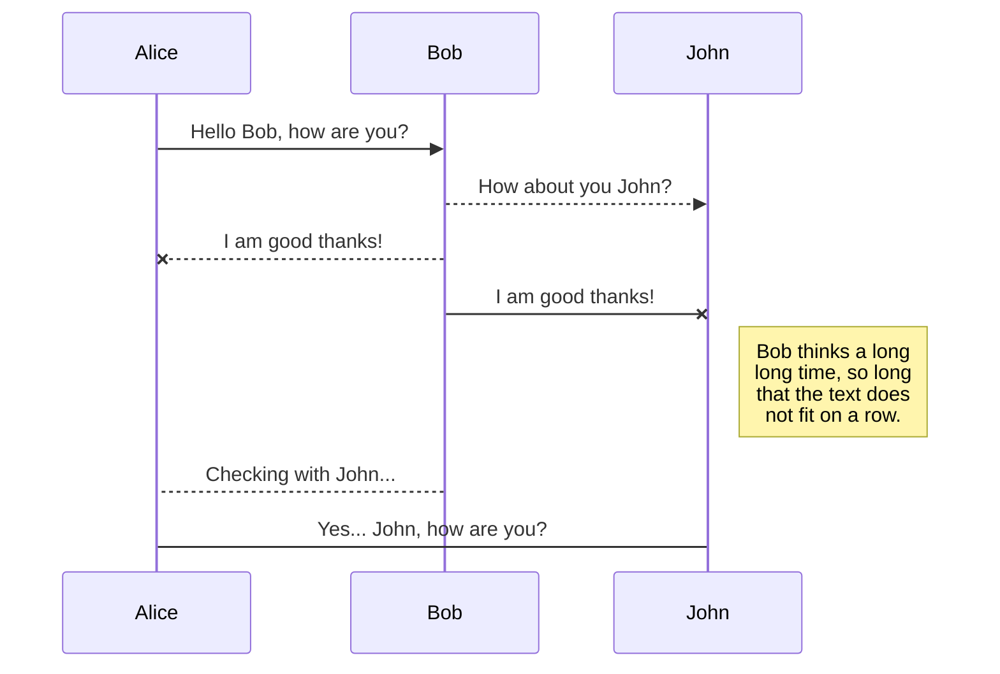
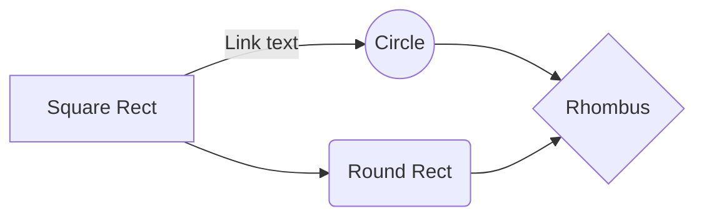

# Guide d'installation API Référentiel GED

## Objectif du document

L'objectif de ce document est de fournir des instructions détaillées et claires pour permettre à un user ou à un technicien d'installer et configurer correctement l'API. Ce guide est conçu pour aider les utilisateurs à travers les différentes étapes du processus d'installation, en fournissant des informations sur les prérequis, les étapes à suivre, les outils nécessaires, et les éventuels problèmes rencontrés et leurs solutions.

## Table des matières

 - Prérequis
 - Installations des logiciels
 - Configuration des logiciels
 - Connexion dépôt GIT
 - Installation et configuration de l'API
 - Première requête à l'API

# Les prérequis

Afin de pouvoir exploité l'API du référentiel il est important de posséder les prérequis suivant : 

 - [x] Node.js installé sur le poste ou le serveur
 - [x] My SQL  Serveur installé sur le poste ou le serveur
 - [x] Git installé sur le poste ou le serveur
 
 #### &#9888; Important  &#9888; 
Il est important de noter que l'API peut être utilisé de différente façon. Si elle est **installé sur un poste informatique** cela veut dire que son **utilisation sera à des fins de développement** et **non de recette** ou **de production**.

Pour utilisé l'API a des fins de **recette ou de production** il est conseillé de l'installer sur un **serveur adéquat**. Il sera donc possible qu'il faudra **ouvrir les ports dans le pare feu pour utilisé l'API sur le réseau**.

# Installation des logiciels et configuration

## Node.js

Node.js est le pilier  de l'API c'est sur cette technologie que tous se base pour faire fonctionné l'enssemble.

Pour commencer il faut se rendre sur le site pour télécharger le logiciel. ( [cliquer ici](https://nodejs.org/en/about/previous-releases) )

Une fois sur le site il est toujours préférable de **télécharger la version LTS**. La dernière version à ce jour est la 20.11.1, dans notre cas à pour rendre le tous le plus compatible possible il sera **préférable de télécharger la version 18**.

Une fois le téléchargement terminer on peut exécuter le setup d'installation. Pendant l'installation il faut globalement cliquer sur suivant à chaque fois. Cependant il ne faut **pas cocher la case concernant *Chocolatey***.

Pour vérifier que node.js est correctement installé on peut exécuter le commande suivante dans un invite de commande ( cela peut être windows, powershell,bash etc ).

```
node -v ( Cette commande retourne la version de node.js )
```
```
npm -v ( Cette commande retourne la version de gestionnaire de paquet node.js )
```

Avant de passer à la prochaine installation nous allons installer des paquets nécessaire pour l'utilisation de l'API. Ces paquets seront installés en global sur le poste ou le serveur. C'est à dire qu'il pourront être utilisé n'importe où et pas seulement dans un projet node.js. 

Nous allons commence par installer le paquet yarn. Pour résumer yarn est un gestionnaire de paquet "simplifié". 
( [cliquer ici pour la documentation de yarn](https://www.npmjs.com/package/yarn) )

Dans une invite de commande nous allons faire a commande suivante.
```
npm install --global yarn ( le --global permet de spécifié une installation global )
```
Ensuite, pour vérifier son installation faire la commande suivante :
```
yarn -v
```
 #### &#9888; Important  &#9888; 
 Dans une invite powershell il est possible d'avoir une erreur d'exécution. C'est la restriction d'exécution des script qui est active par défaut. 

Pour enlever la restriction on commence par ouvrir une fenêtre powershell en mode administrateur. Puis faire la commande suivante : 
```
Set-ExecutionPolicy Unrestricted
```
Le système va alors vous proposez plusieurs choix, sélectionner l'option "**[T] Oui pour tout**".
Cliquer sur la touche **T** puis faire **entrée**. Refaire maintenant le *yarn -v*, cela devrai fonctionner.

 #### &#9888; Fin du important  &#9888; 

Maintenant que yarn est installé nous allons pouvoir installer **PM2**. PM2 est un micro logiciel qui permet de créer ce qu'on appel des tâches en arrières plans pour des projets node.js. Cela nous servira faire tourner l'API en arrière plan sur notre poste ou le serveur. Ce paquet est essentiel pour une installation de production ou de recette.

Faire la commande suivante : 
```
npm install --global pm2
```
Pour vérifier l'installation de pm2 nous pouvons faire la commande suivante : 
```
pm2 monit
```
Cette commande nous permet d'afficher la liste de nous processus qui tourne en arrière plan, dans notre cas la liste est vide pour le moment.

## Installation de GIT

GIT est essentiel pour pouvoir installer l'API, il nous permet de se connecter au dépôt distant pour récupérer le code de l'API. Il peut donc également servir pour mettre à jour l'API quand une nouvelle version sors.

Pour commencer on va télécharger l'installateur. ( [cliquer ici](https://git-scm.com/download/win) ) 

Une fois le téléchargement terminé on va lancer l'installation. Lors de l'installation beaucoup de question nous serons posés voici les plus importantes : 

 - A l'étape "**Chossing the default editor used by Git**", ici il faut renseigner l'éditeur de code que vous utilisez principalement.
 - A l'étape "**Adjusting the name of the initial branch in new repositories**", ici choisir la deuxième option et écrire **main**.
 - A  l'étape "**Adjusting your path environnement**", prendre la troisième option.
 - A l'étape "**Chossing the ssl executable**", prendre l'option un.
 - A l'étape "**Chossing HTTPS transport backend**", prendre l'option un.
 - A l'étape "**Configuring the line ending conversions**", prendre l'option un.
 - A l'étape "**Configuring the terminal emulator to use with Git Bash**", prendre l'option 2.
 - A l'étape "**Choose the default behavior of 'git pull'**", prendre l'option 1.
 - A l'étape "**Choose a credential helper**", prendre l'option 1.
 - A l'étape "**Configuration extra options**", cocher la première case.
 - A l'étape "**Configuration experimental options**", ne rien faire et cliquer sur install.

Une fois l'installation terminé, nous pouvons vérifier que GIT est opérationnel en faisant la commande suivante dans un terminal : 

```
git -v
```
Pour terminer nous allons configurer notre compte dans GIT, pour se faire il y aura deux commandes.

On va ajouter notre nom dans la configuration GIT grâce à la commande suivante : 
```
git config --global user.name "Mona Lisa"
```
Puis maintenant on va mettre son email.
```
git config --global user.email "Votre email"
```
La configuration de GIT est maintenant terminé.

## Installation de My SQL Serveur

SQL Seveur prend une partie très importante pour l'API. C'est ce qui va serveur en outre de pont entre les données venant d'H@lis et les donnée de la GED.

Si vous utilisez vous installez l'API pour develloper où pour recetter vous pouvez utiliser My SQL Serveur express qui est une version gratuite de My SQL serveur. 

Pour la production il est vivement conseillé d'utiliser une licence payante, comme spécifier dans les conditions d'utilisation de My SQL Serveur.

[Cliquer ici pour télécharger SQL Express](https://www.microsoft.com/fr-fr/download/details.aspx?id=101064)

L'installation de sql Serveur peut être complexe et ne sera pas détaillé ici.

Une fois l'installation terminé quelque configurations sont requises.

Ouvrir le logiciel **Sql Server Configuration Manager** ( Installé en même temps qu'express )

Aller dans l'onglet **Configuration du réseau SQL Server**, puis double cliquer sur votre serveur.

Ensuite double clique sur **TCP/IP**, puis aller sur l'onglet **Adresses IP**.

Chercher l'adresse IP **127.0.0.1** et faire les actions suivante : 

 - Actif : Oui
 - Activé : Oui
 - Ports TCP : vide
 - Ports TCP dynamiques : 0

Pour finir, aller tout en bas de l'onglet et dans **Ports TCP dynamiques** de la section **IPAll** mettre le port suivant : **55961**.

Ces actions servent à définir le port d'écoute pour la connexion au serveur SQL.

Maintenant, nous pouvons ouvrir SQL Server Management en **mode administrateur**.

Faire un clique droit sur la racine de notre serveur puis aller sur **Propriétés**.

Dans l'onglet **Sécurité** faire les actions suivantes : 

 - Cocher **Mode d'authentification SQL Server et Windows**
 - Cocher **Echecs de connexion uniquement**

## Rename a file

You can rename the current file by clicking the file name in the navigation bar or by clicking the **Rename** button in the file explorer.

## Delete a file

You can delete the current file by clicking the **Remove** button in the file explorer. The file will be moved into the **Trash** folder and automatically deleted after 7 days of inactivity.

## Export a file

You can export the current file by clicking **Export to disk** in the menu. You can choose to export the file as plain Markdown, as HTML using a Handlebars template or as a PDF.


# Synchronization

Synchronization is one of the biggest features of StackEdit. It enables you to synchronize any file in your workspace with other files stored in your **Google Drive**, your **Dropbox** and your **GitHub** accounts. This allows you to keep writing on other devices, collaborate with people you share the file with, integrate easily into your workflow... The synchronization mechanism takes place every minute in the background, downloading, merging, and uploading file modifications.

There are two types of synchronization and they can complement each other:

- The workspace synchronization will sync all your files, folders and settings automatically. This will allow you to fetch your workspace on any other device.
	> To start syncing your workspace, just sign in with Google in the menu.

- The file synchronization will keep one file of the workspace synced with one or multiple files in **Google Drive**, **Dropbox** or **GitHub**.
	> Before starting to sync files, you must link an account in the **Synchronize** sub-menu.

## Open a file

You can open a file from **Google Drive**, **Dropbox** or **GitHub** by opening the **Synchronize** sub-menu and clicking **Open from**. Once opened in the workspace, any modification in the file will be automatically synced.

## Save a file

You can save any file of the workspace to **Google Drive**, **Dropbox** or **GitHub** by opening the **Synchronize** sub-menu and clicking **Save on**. Even if a file in the workspace is already synced, you can save it to another location. StackEdit can sync one file with multiple locations and accounts.

## Synchronize a file

Once your file is linked to a synchronized location, StackEdit will periodically synchronize it by downloading/uploading any modification. A merge will be performed if necessary and conflicts will be resolved.

If you just have modified your file and you want to force syncing, click the **Synchronize now** button in the navigation bar.

> **Note:** The **Synchronize now** button is disabled if you have no file to synchronize.

## Manage file synchronization

Since one file can be synced with multiple locations, you can list and manage synchronized locations by clicking **File synchronization** in the **Synchronize** sub-menu. This allows you to list and remove synchronized locations that are linked to your file.


# Publication

Publishing in StackEdit makes it simple for you to publish online your files. Once you're happy with a file, you can publish it to different hosting platforms like **Blogger**, **Dropbox**, **Gist**, **GitHub**, **Google Drive**, **WordPress** and **Zendesk**. With [Handlebars templates](http://handlebarsjs.com/), you have full control over what you export.

> Before starting to publish, you must link an account in the **Publish** sub-menu.

## Publish a File

You can publish your file by opening the **Publish** sub-menu and by clicking **Publish to**. For some locations, you can choose between the following formats:

- Markdown: publish the Markdown text on a website that can interpret it (**GitHub** for instance),
- HTML: publish the file converted to HTML via a Handlebars template (on a blog for example).

## Update a publication

After publishing, StackEdit keeps your file linked to that publication which makes it easy for you to re-publish it. Once you have modified your file and you want to update your publication, click on the **Publish now** button in the navigation bar.

> **Note:** The **Publish now** button is disabled if your file has not been published yet.

## Manage file publication

Since one file can be published to multiple locations, you can list and manage publish locations by clicking **File publication** in the **Publish** sub-menu. This allows you to list and remove publication locations that are linked to your file.


# Markdown extensions

StackEdit extends the standard Markdown syntax by adding extra **Markdown extensions**, providing you with some nice features.

> **ProTip:** You can disable any **Markdown extension** in the **File properties** dialog.


## SmartyPants

SmartyPants converts ASCII punctuation characters into "smart" typographic punctuation HTML entities. For example:

|                |ASCII                          |HTML                         |
|----------------|-------------------------------|-----------------------------|
|Single backticks|`'Isn't this fun?'`            |'Isn't this fun?'            |
|Quotes          |`"Isn't this fun?"`            |"Isn't this fun?"            |
|Dashes          |`-- is en-dash, --- is em-dash`|-- is en-dash, --- is em-dash|


## KaTeX

You can render LaTeX mathematical expressions using [KaTeX](https://khan.github.io/KaTeX/):

The *Gamma function* satisfying $\Gamma(n) = (n-1)!\quad\forall n\in\mathbb N$ is via the Euler integral

$$
\Gamma(z) = \int_0^\infty t^{z-1}e^{-t}dt\,.
$$

> You can find more information about **LaTeX** mathematical expressions [here](http://meta.math.stackexchange.com/questions/5020/mathjax-basic-tutorial-and-quick-reference).


## UML diagrams

You can render UML diagrams using [Mermaid](https://mermaidjs.github.io/). For example, this will produce a sequence diagram:



And this will produce a flow chart:

